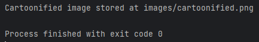
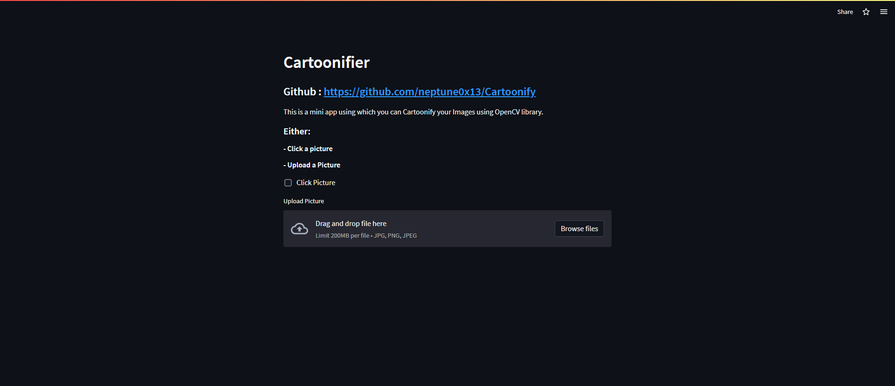

# Cartoonify Computer Vision Project
### Try at: [Streamlit](https://kunal-attri-cartoonify-streamlit-main-o169mo.streamlit.app/)

- This is a mini app to cartoonify any image.
- We have implemented it as:
  - CLI app
  - Streamlit web app

## Requirements
- [opencv-python](https://pypi.org/project//opencv-python)
- [opencv-contrib-python](https://pypi.org/project/opencv-contrib-pythn)
- [easygui](https://pypi.org/project/easygui)
- [numpy](https://pypi.org/project/numpy/)
- [imageio](https://pypi.org/project//imageio)
- [matplotlib](https://pypi.org/project/matplotlib)
- [Pillow](https://pypi.org/project/Pillow)
- [streamlit](https://pypi.org/project/streamlit/)

## What we used?
- [OpenCV](https://opencv.org/) - To manipulate the image, and cartoonify it.
- [Streamlit](https://streamlit.io/) - For GUI Web App

## How to run the program?
1. Try on [Streamlit](https://kunal-attri-cartoonify-streamlit-main-o169mo.streamlit.app/)
2. Run CLI app:
   - Clone Repository
     ```
     git clone https://github.com/neptune0x13/Cartoonify.git
     ```
   - Open terminal in project folder
   - Install requirements
     ```
     pip3 install -r requirements.txt
     ```
   - Run CLI app
     ```
     python3 main.py
     ```
     - *Expected Interface*
       <br>
3. Run Streamlit app
  - Try on web [here](https://kunal-attri-cartoonify-streamlit-main-o169mo.streamlit.app/)
  - Run locally
    ```
    streamlit run streamlit_main.py
    ```
  - *Expected Interface*
    <br>

## References
- [Streamlit](https://docs.streamlit.io/)
- [Cartoonify](https://data-flair.training/blogs/cartoonify-image-opencv-python/)
- [OpenCV](https://docs.opencv.org/4.6.0/df/d65/tutorial_table_of_content_introduction.html)